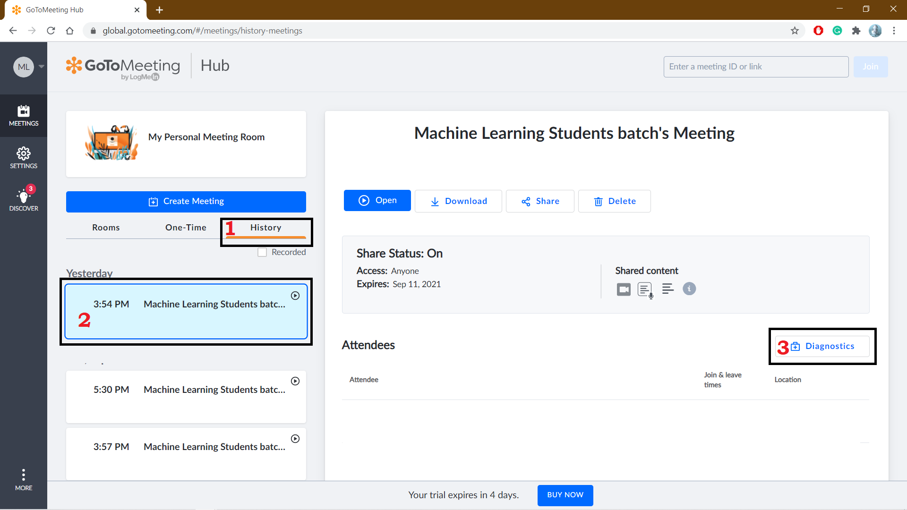

# GoToMeeting Student Roll No. Extraction For Attendance using Python
This Repo Contains the python module and sample PY Notebook for giving the attendance to the students from GoToMeeting attendance excel sheet

## Step 1: Clone this Repository

clone this repo using the below git command

```git
git clone git@github.com:AnilKumarTeegala/GotoMeeting-Attendance-using-Python-Program.git
```

## Step2: Download GoToMeeting Attendees Data

1. Login to https://global.gotomeeting.com/#/meetings

   

2. After Login click on

   1. History
   2. Select desired meeting date
   3. click on Diagnostics it will redirect you to new page

3.  In the redirected page scroll to bottom to observe download attendee list hyperlink click on that it will automatically download the attendees list in `.xls` format

## Step 3 Save Main Attendees Data

you have to save the main registered data in the `.csv` format

## Step 4: Now Open `GotoMeeting_Student_RollNo_Extraction_For_Attendance.ipynb`

To know how its working I've added sample students data and GoToMeeting attendees data so run all the cells and then one excel sheet will be generated with the given file name generate with rollNo and Present/Absent column.

The file name will be the givenFileName.xlsx

**`Note`** Go to meeting Student Login name should be `rollNumber[sep]Name[sep]CollegeName` -- Here `sep` can be `" " (space)`, `-`,` _`.

1. After update the file paths of your original student in`.csv` and GoToMeeting attendance in `.xls` format and update the file name of the output file as your wish final output sheet will be generated in the cloned directory


Hope it will help you🙂
